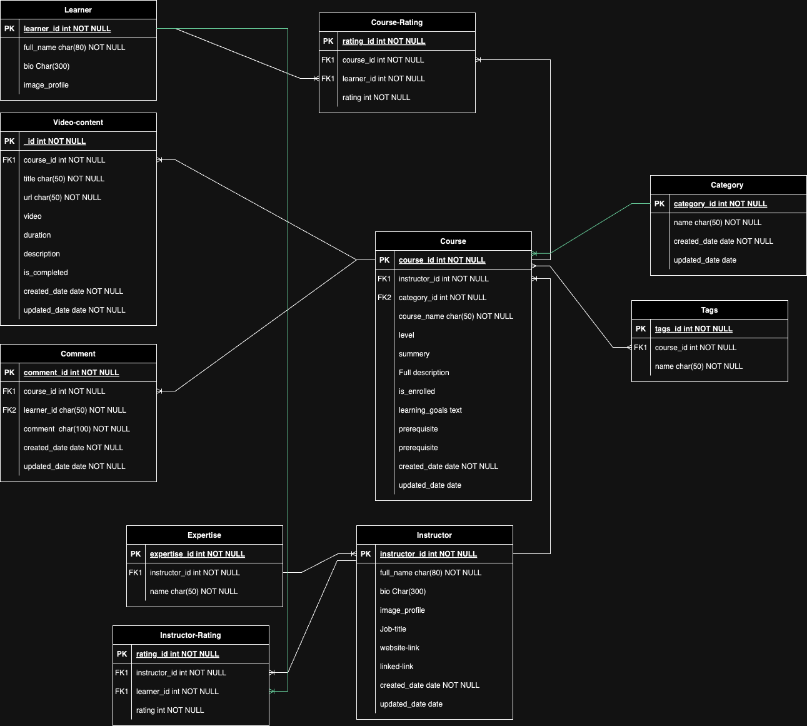
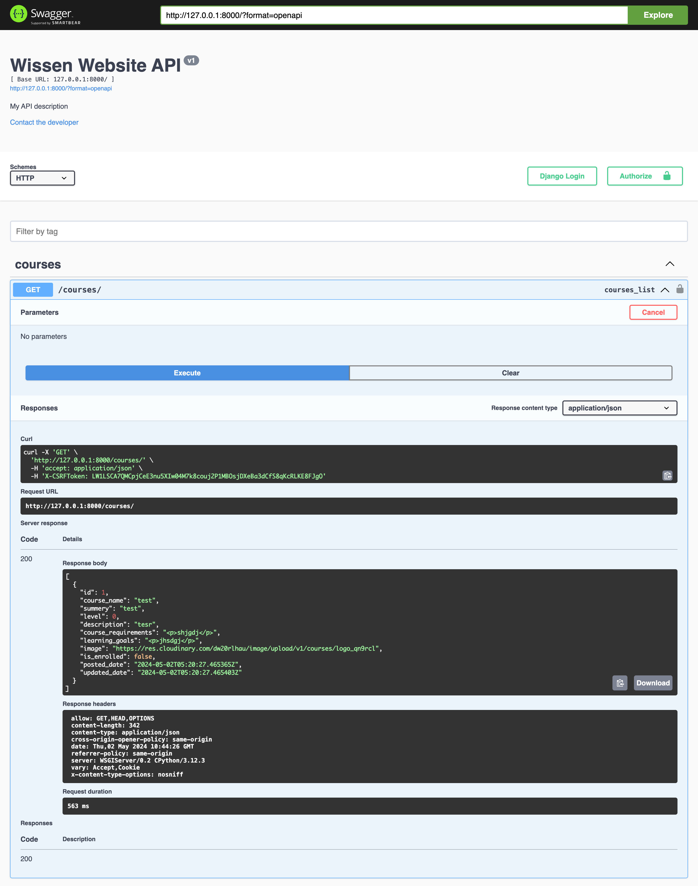

# wissen_api
Wissen - Your Gateway to Knowledge

## Project Description
Wissen is an innovative online learning platform designed to provide learners with access to a diverse range of 
courses across various subjects, while empowering instructors to share their expertise and 
engage with students globally. With intuitive navigation, personalized recommendations, and interactive features, 
Wissen offers a dynamic learning experience tailored to individual needs and preferences.

## User Stories
The application follows Agile methodology and is managed using a Kanban board, which you can access
on [kanban board](https://github.com/users/raneem-yad/projects/5/views/1?visibleFields=%5B%22Title%22%2C%22Assignees%22%2C%22Status%22%2C%22Labels%22%2C%22Milestone%22%5D) 
The project prioritization is done according to the MOSCOW method. For detailed user stories, acceptance criteria,
and associated tasks, please refer to this [link](https://github.com/raneem-yad/wissen/issues). Each user story is
meticulously defined with its respective acceptance criteria and tasks.

### User stories according to Epics
#### Authentication:
1. As a backend developer, I want to design and implement APIs for user authentication, including sign up, to enable users to access their accounts securely.
2. As a backend developer, I want to design and implement APIs for user authentication, including sign in, to enable users to access their accounts securely.
3. As a backend developer, I want to design and implement APIs for user authentication, including  sign out, to enable users to access their accounts securely.
#### Homepage Features:
1. As a backend developer, I want to create APIs for retrieving and displaying course information, including details, ratings, reviews, and instructor data, to populate the frontend of the website.
#### Course Discovery and Filtering
1. As a backend developer, I want to develop APIs for searching, to provide users with a seamless browsing experience.
2. As a backend developer, I want to develop APIs for  filtering courses based on various criteria, such as category, level, duration, and rating, to provide users with a seamless browsing experience.
3. As a backend developer, I want to develop APIs for sorting courses alphabetically, oldest added, newly added courses to provide users with a seamless browsing experience.
#### Course Enrollment and Interaction:
1. As a backend developer, I want to design and implement APIs for course enrollment, allowing users to enroll in courses and track their progress.
2. As a backend developer, I want to develop APIs for course creation and management, allowing instructors to add, edit, and delete courses from the platform.
3. As a backend developer, I want to implement APIs for handling user interactions, such as comments, to facilitate engagement and feedback.
4. As a backend developer, I want to implement APIs for handling user interactions, such as  ratings, to facilitate engagement and feedback.
5. As a backend developer, I want to implement an API endpoint that retrieves all courses belonging to a specific category, So that users can easily browse and access courses within their areas of interest.
6. As a backend developer, I want to get all courses according to a tags.
#### Profile Pages:
1. As a backend developer, I want to create APIs for user profiles, including retrieval, update, and deletion of user information, to manage user accounts efficiently.
2. As a backend developer, I want to create APIs for generating analytics and insights on course performance, including completion rates, engagement metrics, and learner feedback, to support data-driven decision-making for instructors and administrators.

## Entity Relationship Diagram
Database schema was drawn up using [App Diagrams.net](https://app.diagrams.net/). The schema was used to plan the database models and fields. 
It also helped in displaying the relationships between the models and how they interact. There were some changes 
between the designed database and the implemented one due to more clarity when implementing the project


### Explaining the relationship between Models

#### Course Model and other tables:
1. **with Category Model:** Each course belongs to one category, and each category can have multiple courses. So, the relationship should be **one-to-many** from Category to Course.
2. **with Tags Model:** Each course can have multiple tags, and each tag can be associated with multiple courses. Therefore, this relationship should be **many-to-many**.
3. **with Rate Model:** Each course can have multiple ratings, but each rating belongs to only one course. So, the relationship should be **one-to-many** from Course to Rate.
4. **with Student Model:** Each course can have multiple students enrolled, and each student can enroll in multiple courses. Therefore, this relationship should be **many-to-many**.
5. **with Instructor Model:** Each course is taught by one instructor, and each instructor teaches multiple courses. So, the relationship should be **many-to-one** from Course to Instructor.
6. **with Comment Model:** Each course can have multiple comments, but each comment belongs to only one course. So, the relationship should be **one-to-many** from Course to Comment.
7. **with Video-Content Model:** Each course can have multiple Videos, but each Video belongs to only one course. So, the relationship should be **one-to-many** from Course to Video-Content.


#### Instructor Model and other tables:
1. **with Course Model:** Each course is taught by one instructor, and each instructor teaches multiple courses. So, the relationship should be **many-to-one** from Course to Instructor.
2. **with Expertise Model:** Each Instructor can have multiple Expertise, and each Expertise can be associated with multiple instructors. Therefore, this relationship should be **many-to-many**.
3. **with Instructor-Rate Model:** Each Instructor can have multiple ratings, but each rating belongs to only one Instructor. So, the relationship should be **one-to-many** from Instructor to Rate.

## Models and CRUD Breakdown
### Instructor Model

| HTTP | URI                          | CRUD operation                    | view name                 |
|------|------------------------------|-----------------------------------|---------------------------|
| GET  | instructors/                 | list all instructors              | LIST                      |
| GET  | instructors/top-instructors/ | list top 6 instructors            | LIST                      |
| POST | instructors/                 | create a instructor               |                           |
| GET  | instructors/:id/             | retrieve a instructor by id       | DETAILS                   |
| GET  | instructors/:id/expertise/   | retrieve expertises by instructor | ExpertiseByInstructorList |
| PUT  | instructors/:id/             | Update  a instructor by id        |                           |


### Course Category Model

| HTTP   | URI            | CRUD operation            | view name |
|--------|----------------|---------------------------|-----------|
| GET    | categories/    | list all categories       | LIST      |
| POST   |                | create a category         |           |
| GET    | categories/:id | retrieve a category by id | DETAILS   |
| PUT    |                | Update  a category by id  |           |
| DELETE |                | Delete  a category by id  |           |


### Courses Model

| HTTP   | URI                                   | CRUD operation               | view name              |
|--------|---------------------------------------|------------------------------|------------------------|
| GET    | courses/                              | list all courses             | LIST                   |
| POST   | courses/                              | create a course              |                        |
| GET    | courses/:id/                          | retrieve a course by id      | DETAILS                |
| GET    | courses/by_category/:category_id/     | get courses by Category_id   | CourseByCategoryList   |
| GET    | courses/by_instructor/:instructor_id/ | Get courses by Instructor_id | CourseByInstructorList |
| GET    | courses/:id/tags/                     | Get tags by course_id        | TagsByCourseList       |
| PUT    | courses/:id/                          | Update  a course by id       | DETAILS                |
| DELETE | courses/:id/                          | Delete  a course by id       |                        |


### Comments Model

| HTTP   | URI          | CRUD operation           | view name |
|--------|--------------|--------------------------|-----------|
| GET    | comments/    | list all comments        | LIST      |
| POST   |              | create a comment         |           |
| GET    | comments/:id | retrieve a comment by id | DETAILS   |
| PUT    |              | Update  a comment by id  |           |
| DELETE |              | Delete  a comment by id  |           |

### Rating Model

| HTTP   | URI         | CRUD operation        | view name |
|--------|-------------|-----------------------|-----------|
| GET    | ratings/    | list all ratings      | LIST      |
| POST   |             | create a rate         |           |
| GET    | ratings/:id | retrieve a rate by id | DETAILS   |
| DELETE |             | Delete  a rate by id  |           |

### Tags Model

| HTTP   | URI              | CRUD operation              | view name        |
|--------|------------------|-----------------------------|------------------|
| GET    | tags/            | list all tags               | LIST             |
| POST   | tags/            | create a tag                |                  |
| GET    | tags/:id/        | retrieve a tags by id       | DETAILS          |
| GET    | tags/:id/courses | retrieve all courses by tag | CoursesByTagList |
| DELETE | tags/:id         | Delete  a tags by id        |                  |


### Expertise Model

| HTTP   | URI                        | CRUD operation                       | view name                  |
|--------|----------------------------|--------------------------------------|----------------------------|
| GET    | Expertise/                 | list all Expertises                  | LIST                       |
| POST   | Expertise/                 | create a Expertise                   |                            |
| GET    | Expertise/:id/             | retrieve a Expertise by id           | DETAILS                    |
| GET    | Expertise/:id/instructors/ | retrieve all instructos by expertise | InstructorsByExpertiseList |
| DELETE | Expertise/:id/             | Delete  a Expertise by id            | DETAILS                    |

### Instructor Rating Model

| HTTP   | URI                   | CRUD operation                          | view name |
|--------|-----------------------|-----------------------------------------|-----------|
| GET    | instructor-rating/    | list all ratings for an instructor      | LIST      |
| POST   |                       | create a rate for an instructor         |           |
| GET    | instructor-rating/:id | retrieve a rate by id for an instructor | DETAILS   |
| DELETE |                       | Delete  a rate by id  for an instructor |           |


## Technology Stack
The backend is powered by a robust stack that ensures efficiency and scalability:
- **Framework**: Django and Django REST Framework for robust API development.
- **Database**: PostgreSQL for reliable and scalable data storage.
- **Authentication**: Utilizes Django's built-in authentication system for secure user authentication.
- **Caching**:  for enhancing application performance.

## API Documentation
The project is seamlessly integrated with Swagger API, offering comprehensive details for each API endpoint. It provides examples, detailed information, and an option to test the endpoints directly.
How to use it ? 

1. scroll down to dj-rest-auth --> POST -->/dj-rest-auth/login/.
2. click on the api to expanded the press on try it out.
3. add you username and password and delete the email if you don't have.
4. press execute then refresh the page you will notice your username has been added as login user.

in that way we can execute any other API Considring if the user has the permission to access the API endpoint.

[deployed link](https://wissen-api-61cc6e37e2b8.herokuapp.com/)


## Security

A permissions class was added called IsOwnerOrReadOnly to ensure only users who create the content are able to edit or delete it.

Another permissions class was added called HasInstructorProfile to ensure only Instructors can create a course , edit or delete it.


## Testing 
The APIs were tested locally during development but the core testing was done as part of the front end repos and testing to the real APIs manually via form inputs and page loads.

The results can be found in [Wissen](https://github.com/raneem-yad/wissen/blob/main/TESTING.md)

**Validator Results**

All folders were run through black. All issues were about  lines too long and were resolved.


# **Deployment**

Here is the [deployment version](https://wissen-api-61cc6e37e2b8.herokuapp.com/).

## **Create Repository**

The first step is to create a new repository, using the [Code Institute Template](https://github.com/Code-Institute-Org/ci-full-template). After creating the repository, you can open it in the IDE of your choice.

If you choose to work in a local IDE, it is important to create a **virtual environment** before continuing. I am using PyCharm, where the local environment can be conveniently set up by adding a new interpreter. Another way is by typing `python -m venv .venv` in the terminal.

## **Project Setup**

1. Install **Django**:
   - `pip install 'django<4'`
2. Create a Django project:
   - `django-admin startproject <name>`
3. Install supporting **libraries**:
   - `pip install django-cloudinary-storage`
   - `pip install Pillow`
4. Create **requirements.txt** file:
   - `pip freeze --local > requirements.txt`
   
## **Database Setup**

You can use a database of your choice, following are the instructions if you use [ElephantSQL](https://customer.elephantsql.com/).

1. Log in to your account
2. Click *Create New Instance*
3. Give the instance a name and select the plan of your choice, *Tiny Turtle* is the free plan.
4. Click *Select Region* and choose a data center near you
5. Click *Review* and if the details are correct click *Create instance*
6. Click on the created instance and copy the database URL

## **Cloudinary Setup**

1. Log in to your [Cloudinary](https://console.cloudinary.com/) account
2. At the dashboard, copy the link from the **API Environment variable**

## **File Changes**

1. In the **settings.py** file add this code:
    ```
    import os
    import dj_database_url
   
    if os.path.isfile("env.py"):  
        import env
    
    SECRET_KEY = os.environ.get("SECRET_KEY")
    DEBUG = "DEVELOPMENT" in os.environ
   
    DATABASES = {
        'default': dj_database_url.parse(os.environ.get("DATABASE_URL"))
    }
    ```
2. In the **env.py** file add this code and ensure the file is added to *.gitignore*:
    ```
    import os

    os.environ["SECRET_KEY"] = "addSecretKeyHere"
    os.environ["DEVELOPMENT"] = "TRUE"
    os.environ["DATABASE_URL"]= "copiedDatabaseURL"
    os.environ["CLOUDINARY_URL"] = "copiedCloudinaryURL"
    ```
3. After these changes, run `python manage.py migrate` to migrate your database structure to the ElephantSQL database.
4. In the **settings.py** file add this code to link to Cloudinary:
    ```
    INSTALLED_APPS = [...
      'cloudinary_storage',
      'django.contrib.staticfiles',
      'cloudinary',
    ...]
   
    # NOTE: the second line should already be in the file, add the line above and below, the order is important)
   
    STATIC_URL = 'static/'
    STATICFILES_STORAGE = 'cloudinary_storage.storage.StaticHashedCloudinaryStorage'
    STATICFILES_DIRS = [os.path.join(BASE_DIR, 'static')]
    STATIC_ROOT = os.path.join(BASE_DIR, 'staticfiles')

    MEDIA_URL = '/media/'
    DEFAULT_FILE_STORAGE = 'cloudinary_storage.storage.MediaCloudinaryStorage'
    ```

## **JWT Setup**

1. Install **dj-rest-auth**:
   - `pip install dj-rest-auth==2.1.9`
2. Add INSTALLED_APPS in **settings.py**:
   - `'rest_framework'`
   - `'rest_framework.authtoken'`
   - `'dj_rest_auth'`
   - `'django.contrib.sites'`
   - `'allauth'`
   - `'allauth.account'`
   - `'allauth.socialaccount'`
   - `'dj_rest_auth.registration'`
3. Add urls to main app **urls.py**:
   - `path('dj-rest-auth/', include('dj_rest_auth.urls'))`
   - `path('dj-rest-auth/registration/', include('dj_rest_auth.registration.urls'))`
4. Set SITE_ID in **settings.py**:
   - `SITE_ID = 1`
5. Install **simplejwt**:
   - `pip install djangorestframework-simplejwt`
6. Add JWT to **settings.py**:
    ```
    REST_FRAMEWORK = {
        'DEFAULT_AUTHENTICATION_CLASSES': [(
            'rest_framework.authentication.SessionAuthentication'
            if 'DEV' in os.environ
            else 'dj_rest_auth.jwt_auth.JWTCookieAuthentication'
        )],
        'DEFAULT_PAGINATION_CLASS':
            'rest_framework.pagination.PageNumberPagination',
        'PAGE_SIZE': 10,
        'DATETIME_FORMAT': '%d.%m.%Y',
    }
    if 'DEV' not in os.environ:
        REST_FRAMEWORK['DEFAULT_RENDERER_CLASSES'] = [
            'rest_framework.renderers.JSONRenderer',
        ]
    
    REST_USE_JWT = True
    JWT_AUTH_SECURE = True
    JWT_AUTH_COOKIE = 'my-app-auth'
    JWT_AUTH_REFRESH_COOKIE = 'my-refresh-token'
    JWT_AUTH_SAMESITE = 'None'
    ```
7. Migrate database:
   - `python manage.py migrate`
   
## **Heroku Setup**

1. Log in to your [Heruko](https://www.heroku.com/) account
2. On the dashboard click *New* - *Create new app*
3. Give the app a unique name
4. Select the region closest to you and click *Create app*
5. Select your created app and open the *Settings* tab 
6. At the *Config Vars* section click *Reveal Config Vars* and add the following:
   - **DATABASE_URL** with the copied URL from ElephantSQL
   - **SECRET_KEY** with your secret key
   - **CLOUDINARY_URL** with the copied URL from Cloudinary
   - **DISABLE_COLLECTSTATIC** with the value 1
   - **ALLOWED_HOST** with the value of your deployed Heroku application URL

## **Final Changes**

1. Add `ALLOWED_HOSTS = ["PROJECT_NAME.herokuapp.com", "localhost"]` in **settings.py**
2. Create a **Procfile** file in the base directory
3. Add to **Procfile**:
    - `release: python manage.py makemigrations && python manage.py migrate`
    - `web: gunicorn <name>.wsgi`
4. In your **Heroku app**: 
   - Go to the *Deploy tab* and connect your GitHub repository
   - Click on *Deploy Branch* at the bottom of the page

## **Forking**

Forking creates a copy of the project on GitHub. Follow these steps to fork this repository:
1. Log in to your GitHub account and navigate to [Wissen-API repository](https://github.com/raneem-yad/wissen_api).
2. Click the **Fork** button on the top right of the repository.
3. You can now open the forked copy of this project as your own repository.
4. Follow the above steps to work on the project.

# **Packages**

- [cloudinary](https://pypi.org/project/cloudinary/) and [django-cloudinary-storage](https://pypi.org/project/django-cloudinary-storage/) -  integrate the application with Cloudinary.
- [gunicorn](https://pypi.org/project/gunicorn/) - Python WSGI HTTP Server for UNIX.
- [psycopg2](https://pypi.org/project/psycopg2/) - PostgreSQL database adapter.
- [Pillow](https://pypi.org/project/Pillow/) - Python Imaging Library.
- [django-allauth](https://docs.allauth.org/en/latest/) - authentication, registration, account management.
- [dj-rest-auth](https://dj-rest-auth.readthedocs.io/en/latest/) - REST API endpoints.
- [django-cors-headers](https://pypi.org/project/django-cors-headers/) - adds Cross-Origin-Resource Sharing (CORS) headers to responses.
- [djangorestframework-simplejwt](https://django-rest-framework-simplejwt.readthedocs.io/en/latest/) - JSON web token authentication.
- [django-countries](https://github.com/SmileyChris/django-countries) - provides country choices.
- [Django RichTextField](https://github.com/django-ckeditor/django-ckeditor) - offers a convenient solution for incorporating rich text editing capabilities.
- [Django Resized](https://github.com/un1t/django-resized) - simple way to handle image resizing with ease.
- [DRF-YASG](https://github.com/axnsan12/drf-yasg) -  integrate Swagger with Django REST Framework API.

[//]: # (- [python-magic]&#40;https://github.com/ahupp/python-magic#dependencies&#41; - necessary to upload videos to cloudinary.)

[//]: # (- [coverage]&#40;https://coverage.readthedocs.io/en/7.4.4/&#41; - to measure testing coverage.)
[//]: # (- [django-filters]&#40;https://django-filter.readthedocs.io/en/stable/&#41; - to implement filter functionality.)
